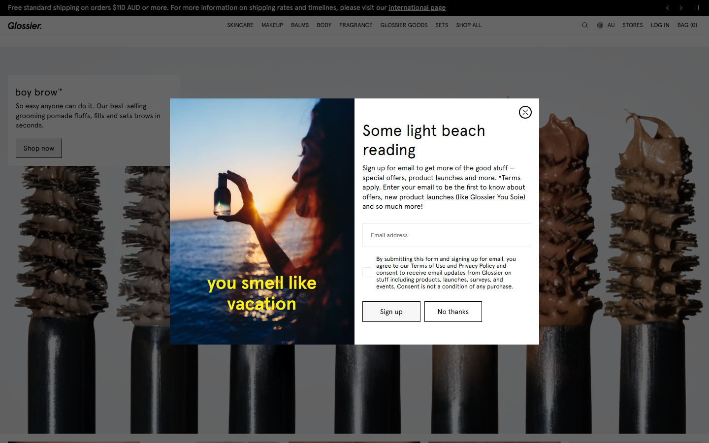

# UI exploration - AusCinema Seat Finder

Seven whole-page directions for the same product question: *find the cinema seat actually worth
sitting in, then hand off to the official booking page.* Each mock holds the **same data** (Toy Story 5
/ Event George St / six ranked sessions), so the only variable is design.

**Live gallery:** [open the showcase](https://miloli-git.github.io/auscinema-seatfinder/) ·
or open `index.html` locally.

## The directions

| # | Direction | Grounded in | Data | Idea |
|---|-----------|-------------|------|------|
| A | [Transit Board](mocks/a-transit.html) | original | synthetic | Light departure-board / boarding-pass; tabular mono, ticket-stub hero. |
| B | [Locomotive](mocks/b-locomotive.html) | [locomotive.ca](extractions/locomotive-DESIGN.md) | synthetic | Swiss-brutalist editorial; serif numerals, hairline catalogue rows, heatmap as the only colour. |
| C | [Terminal](mocks/c-terminal.html) | original | synthetic | Dense keyboard-first (Linear / Raycast); command bar, mono table, data-grid heatmap. |
| D | [Cinematic](mocks/d-cinematic.html) | original | synthetic | Immersive dark room; raked perspective, seat quality as luminance. |
| E | [Glossier](mocks/e-glossier.html) | [glossier.com](extractions/glossier-DESIGN.md) | synthetic | Soft minimalist; blush fields, humanist sans, cosmetics swatch heat ramp. |
| F | [Sydney Opera House](mocks/f-soh-whats-on.html) | [sydneyoperahouse.com](extractions/soh-DESIGN.md) | synthetic | A "What's On" browse page; animated CSS hero, colour-block poster captions. |
| G | [Glossier x SOH hybrid](mocks/g-glossier-soh-hybrid.html) | Glossier x SOH | **real layout** | The convergence; renders a real Event recliner auditorium with a cinematic glow heatmap. |

## How it was made

Two things in here are reusable beyond the mocks:

- **Design-system extraction.** Live sites were scraped with Playwright (computed styles, CSS custom
  properties, type scale, button and gradient treatments) and synthesised into structured specs at
  [`extractions/*-DESIGN.md`](extractions/) - exact tokens plus prose on how to apply them. The
  grounded directions (B, E, F, G) are built from those specs, not from eyeballing screenshots.
- **Real auditorium geometry.** Direction G does not use a synthetic grid. Real captured seat maps
  are run through the project's own chain adapters and seat scorer and normalised into
  [`data/real-layouts.json`](data/real-layouts.json): true row/column positions, seat classes
  (daybed / recliner / standard), availability, and the auditorium's score range. Four real
  auditoriums are included (Event, Hoyts, two Village houses); G renders the Event recliner house
  (10 rows, 156 seats) with class-driven seat widths, so the layout reads as a real cinema, not a
  template.

  *Honest note:* in G the geometry, seat classes and status are real; the per-seat score numbers are
  recomputed at render time (the captured fixture's scores did not survive id-mapping in the export).

## Constraints

Every mock is a **single self-contained HTML file** - no external fonts, images, scripts, CDNs or
frameworks. All "photos" and posters are CSS. They render straight from `file://`. No em or en dashes
anywhere (a house style rule). Dark, light, animated and perspective variants all pass a headless
render check with zero console errors.

## Status

Exploration only, and a deliberate starting point rather than a finished system - this is me taking a
backend-leaning project and pushing the front end further, with the intent to keep developing the
chosen direction until it feels like my own. None of these are wired into the production app
(`apps/web`) yet; the shipped UI is the locked v1 documented in [`../DESIGN.md`](../DESIGN.md). G is
the current front-runner to take forward.
