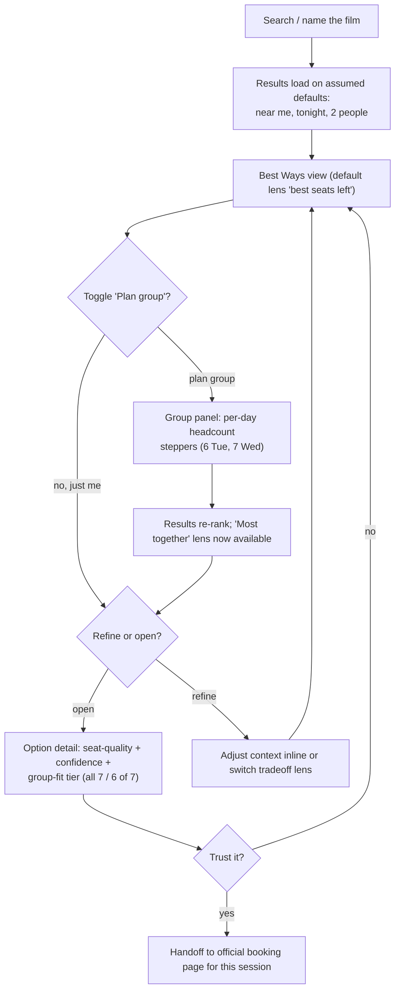
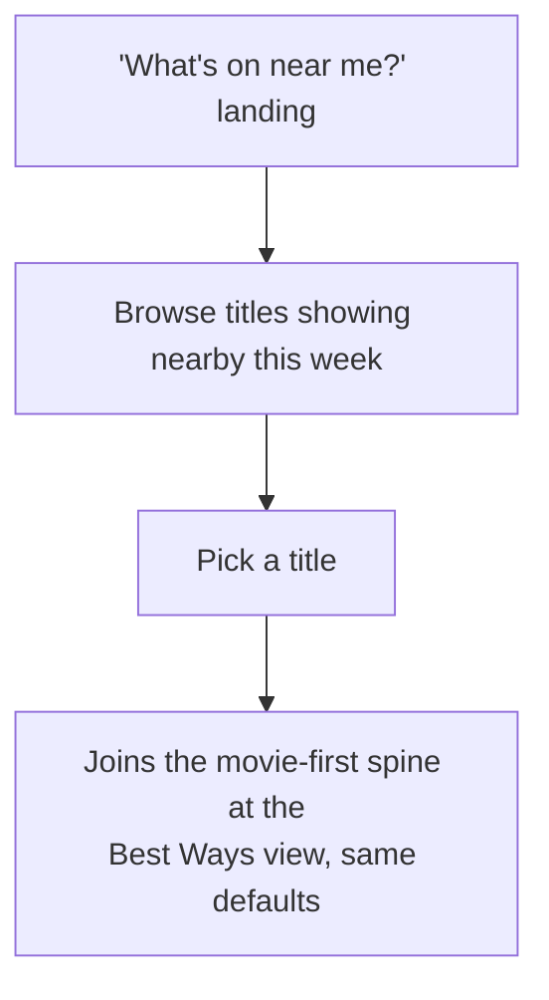
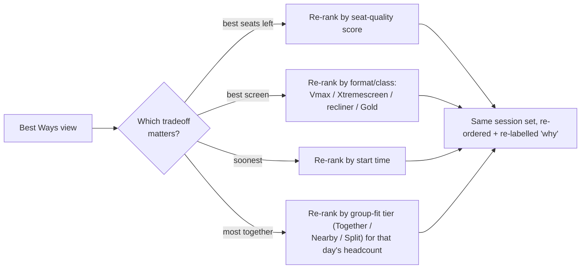
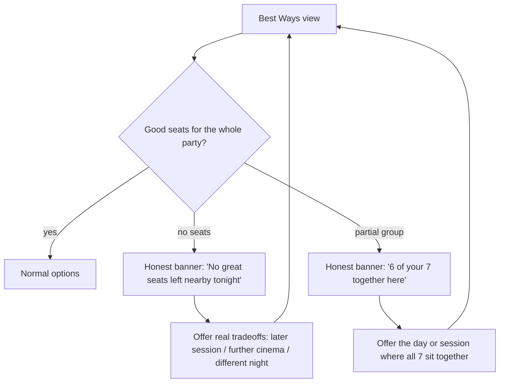
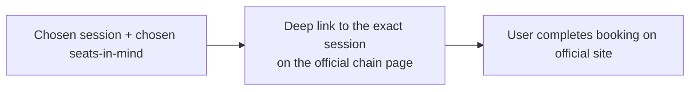

# 03 · Flows + Concepts — Movie-Forward Reframe

Closes the first diamond and opens the second. **Stage 6** (user flows) + **Stage 7** (divergent
concepts). Built on [01 · Framing Brief](./01-framing-brief.md) and
[02 · Journey Map + IA](./02-journey-and-ia.md). See the [journey index](./README.md) for the walk.

**Locked decisions carried in:**
- Two co-primary personas: solo / fixed party and group organiser (solo = N=1).
- Entry: movie-first primary, browse co-equal (the SOH direction = browse surface).
- Decision model: Tradeoff Chooser.
- v1 lenses (4): best seats left / best screen / soonest / most together (crowding deferred).
- Most together (turnout) = three-tier fit (Together / Nearby / Split) for that day's headcount.
- Context: solo defaults + skip-to-results; organiser sets per-day headcount via steppers.
- **Organiser mode = a visible "Plan group" toggle** on the context bar (revised after a Codex UX
  review): solo stays the default skip-to-results path, the toggle reveals the per-day steppers and the
  "Most together" lens. (Earlier draft buried this behind a hidden "+ group" tap; changed to a visible
  mode so the co-primary organiser isn't discovered by accident.)

Still lo-fi. Flows are boxes and arrows; concepts are described layouts, not styled mocks.

## 6. User flows

### 6a. Happy path (solo default, organiser folds in)

Solo never has to declare itself; the organiser opts in by opening the group panel. The per-day
steppers are the one input the organiser can't be defaulted into, because counts vary by day.

### 6b. Browse entry (co-equal, resolves into the spine)

Browse and movie-first **converge at the Best Ways view**. Browse never has its own results model;
it only resolves a title, then the rest is identical. Keeps one decision model, two doors.

### 6c. Lens-switch / comparison path (the reframe's signature)

Switching a lens **re-ranks the same candidate set and changes the one-line "why"** on each option.
The **most together** chip only appears once group mode is on (it is meaningless for a solo user). It
does not reload or send the user elsewhere — the "let me weigh it my way" payoff.

### 6d. No-good-seats / partial-group honest state (designed, not an error)

The product **says the truth and offers the next-best real move** — including the day where the whole
group fits — rather than padding a list with bad options. Where trust is earned or lost (journey step 4).

### 6e. Handoff path

Handoff carries enough context (cinema + session + the seats the user was shown) that the official
page feels like a continuation, not a restart. We never take payment.

## 7. Divergent concepts (3 to 5 lo-fi, Tradeoff Chooser led)

Avoid first-idea lock-in. Concept C1 is the chosen spine; C2 to C4 are genuine alternates kept cheap
so we test rather than assume. All are lo-fi layout descriptions, not styled.

### C1. Tradeoff Chooser (the spine — design this first)
- Film + light context summary pinned at the top, with a visible **"Just me / Plan group" toggle**;
  Plan group opens the per-day headcount steppers.
- A row of **lens chips**: [Best seats left] [Best screen] [Soonest] — plus **[Most together]** once
  Plan group is on. One is active.
- Under it, a **short ranked list of session cards** (3 to 6), each: cinema + day + time + format, a
  seat-quality signal, a **group-fit tier in group mode** (Together / Nearby / Split, e.g. "all 7
  together" / "6 of 7"), and a one-line "why it's top for *this* lens".
- Tapping a card opens the **option detail** (seat-quality view + confidence + group-fit + handoff).
- Strength: directly expresses the reframe's bet. Risk: lens chips must be instantly legible or it
  reads as just another sort dropdown.

### C2. Best Option First (alternate — lower load)
- One **hero recommendation**: "Your best way to see this" with the reason baked in (in group mode,
  "best night for the group" — the session that fits the most, together).
- Below it, 2 to 3 **alternatives** each tagged with the tradeoff they win ("better seats, later",
  "bigger screen, further", "all 7 fit, different night").
- Strength: minimal cognitive load, confident. Risk: imposes one ranking; weaker if users really do
  weigh differently (A3). Good control to test C1 against.

### C3. Film Night Planner (alternate — conversational entry)
- A single editable sentence: "See **[film]** **[this week]** near **[me]** with **[6–7 of us]**, I
  care most about **[everyone together]**." Each bracket is a tap-to-change token; the headcount token
  expands to the per-day steppers.
- Submitting resolves straight into the Best Ways view.
- Strength: makes the movie-forward + organiser mental model explicit and human. Risk: sentence
  builders can feel gimmicky if the tokens are fiddly on mobile.

### C4. Seat Confidence View (alternate — seat-quality forward)
- Session cards that **lead with the seat-quality map thumbnail + a confidence line** ("good seats
  likely until ~30 min before"; in group mode, "all 7 together until ~6:50") rather than time-first.
- Strength: pushes the true differentiators (seat quality + group-fit) to the front. Risk: heavier per
  card; can overwhelm when scanning many sessions.

### Direction reconciliation (visual, for the second diamond)
- **The Glossier × SOH direction** (real Event recliner layout) = the visual language for the
  **option detail / seat-quality view** (incl. the group-fit readout) in every concept.
- **The SOH "What's On" direction** = the **browse entry** surface (6b), now a first-class door.
- The reframe's job in the second diamond: pour C1's structure into that visual system, with the
  browse landing as the alternate entry. The seven-direction gallery becomes *evidence of
  exploration*, not the product.

## Where the first diamond ends
This is the boundary. Next is **second diamond / Develop**:
- Stage 8 — Wireframes (grayscale, mobile-first) of C1, plus quick frames of C2 for testing.
- Stage 9 — Prototype the critical path (film → Best Ways → group panel + lens switch → option detail
  → handoff).
- Stage 10 — Usability test tasks: a solo task ("see this film Saturday night with one other person")
  and an **organiser task** ("get the most of your 6–7 friends to this film this week, sitting
  together"). Watch for: do they understand *why* an option is top; do they trust the seat logic and
  the group-fit count; is the group panel obvious; is the handoff clear.

## Decision resolved
First diamond complete (frame → JTBD → journey → IA → flows → divergent concepts), now organiser-aware.
Wireframe **C1 + C2** (Best Option First is the cleanest contrast) so the first usability test compares
two real decision models, on both a solo and an organiser task.

Wireframes built on this in [04 · Wireframes C1 + C2](./04-wireframes-c1-c2.md).
